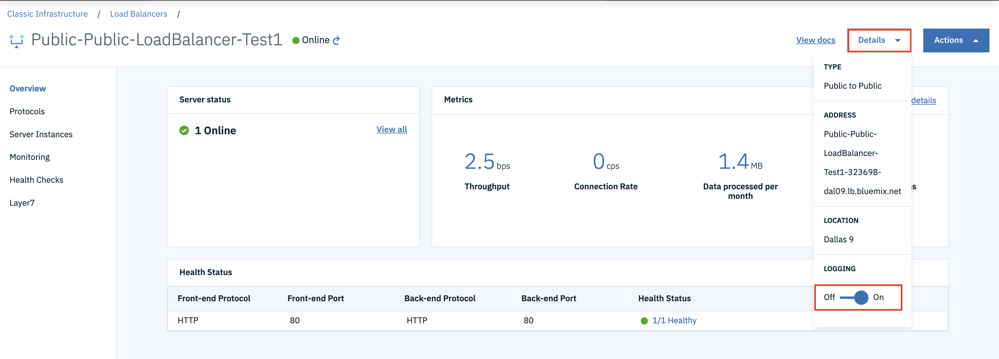

---

copyright:
  years: 2018, 2019
lastupdated: "2019-09-28"

keywords: log, logs, logging, las

subcollection: loadbalancer-service

---

{:shortdesc: .shortdesc}
{:new_window: target="_blank_"}
{:codeblock: .codeblock}
{:pre: .pre}
{:screen: .screen}
{:tip: .tip}
{:download: .download}
{:note: .note}
{:important: .important}

# Data Logging
{: #data-logging}

Data and health check logs are valuable for debugging and maintenance purposes. With the data logging feature enabled, IBM Cloud Load Balancer forwards these logs to the [IBM Log Analysis with LogDNA ](https://cloud.ibm.com/observe/logging){:new_window} under your account.

You can enable or disable this feature by:

* Creating a new load balancer and setting this feature to on.



* Using the API `enableOrDisableDataLogs`.

## Viewing Logs in the IBM Cloud Logging Analysis Service
{: #viewing-logs-in-the-ibm-cloud-logging-analysis-service}

Log into the [IBM Log Analysis with LogDNA ](https://cloud.ibm.com/observe/logging){:new_window} with your IBM Cloud account. Logs can be viewed from the LogDNA instance. Refer to [this topic](/docs/services/Log-Analysis-with-LogDNA?topic=LogDNA-getting-started#getting-started) for more information.

Data logs are only sent if your Softlayer and IBM Cloud accounts are linked.
{: note}

To create a LogDNA instance, perform the following procedure:

1. Select the IBM Cloud account associated with your Softlayer account, then select **Create a logging instance**. The logging instance creation dialog displays.

2. Currently only the Dallas region is supported, so choose **Dallas** from the region dropdown list.

3. Click **Create** to create the logging instance.

4. After you create the logging instance, configure it by clicking **Configure the platform service logs**.

## Log Output Examples
{: #log-output-examples}

The following output is an example of an {{site.data.keyword.loadbalancer_full}} data log:

```
{"datetime":"2019-09-17T03:13:37.373247+00:00", "host":"loadbalancer-dal09-323716-880632-975820", "process":"Cloud Load Balancer", "message":" Connect from xxx.xxx.xxx.xxx:56771 to 169.55.233.136:80 (a9887082-02ff-440c-8e9e-f9026bdc209a\/HTTP)","logSourceCRN":"crn:v1:bluemix:public:logdna:us-south:a/5c59f412bc914beb390b080e07e5e6a2:ffff0000-ffff-0000-ffff-ffff0000ffff::"}
```
Note that:
* `datetime` is UTC time.
* `loadbalancer-dal09-323716-880632-975820` is the load balancer name, and `dal09` is the data center.
* `323716` is the account ID. `880632` is the load balancer ID. `975820` is the load balancer instance ID.
* `xxx.xxx.xxx.xxx` is a public IP which has been masked for GDPR compliance.

The following output is an example of a health check log seen in the IBM Log Analysis using the LogDNA Service:

```
{"datetime":"2019-09-11T08:04:22.534063+00:00", "host":"loadbalancer-dal09-323716-879158-975712", "process":"Cloud Load Balancer", "message":" Health check for server 9a226696-64b7-4f42-a587-74addd178f0e\/81035d8f-5e50-4743-ab04-20987c4c51be-10.143.99.103 succeeded, reason: Layer7 check passed, code: 200, info: \"HTTP status check returned code <3C>200<3E>\", check duration: 2ms, status: 4\/4 UP.","logSourceCRN":"crn:v1:bluemix:public:logdna:us-south:a/5c59f412bc914beb390b080e07e5e6a2:ffff0000-ffff-0000-ffff-ffff0000ffff::"}
```

Note that `10.143.99.103` is the backend server member IP address.
