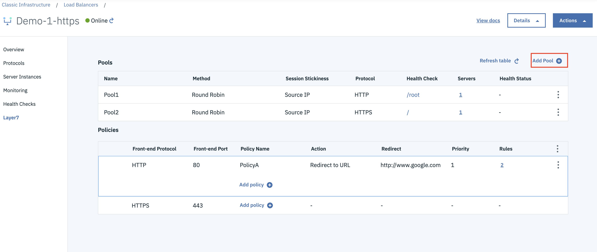
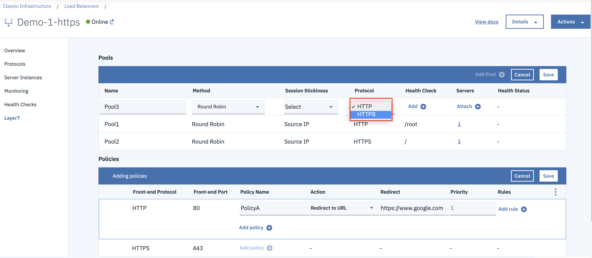
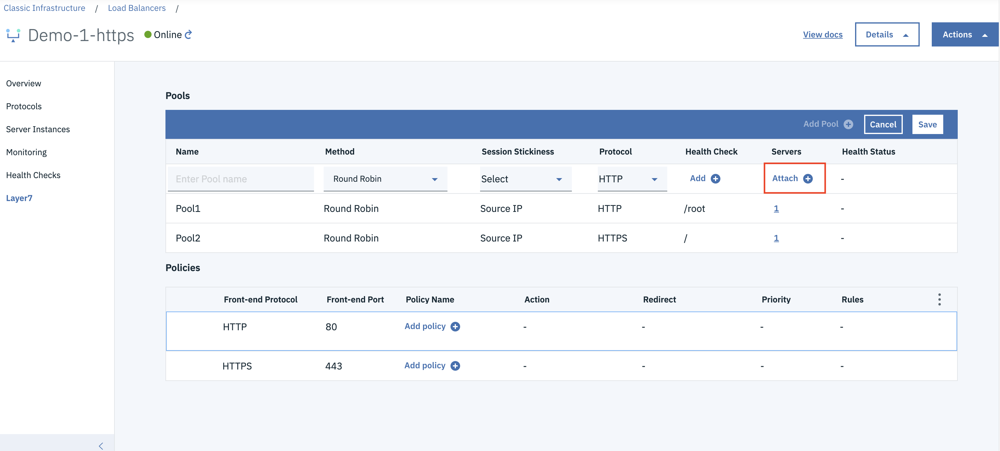
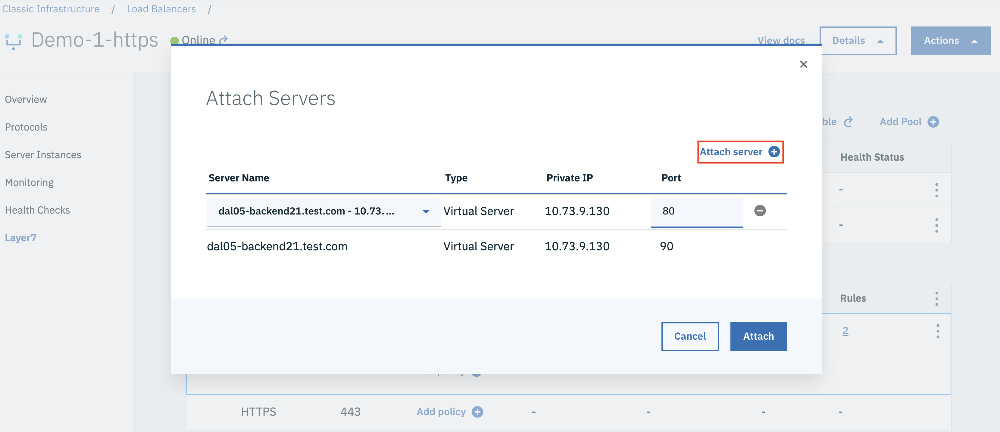
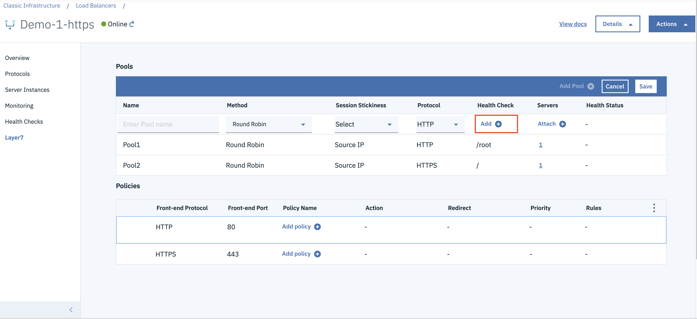
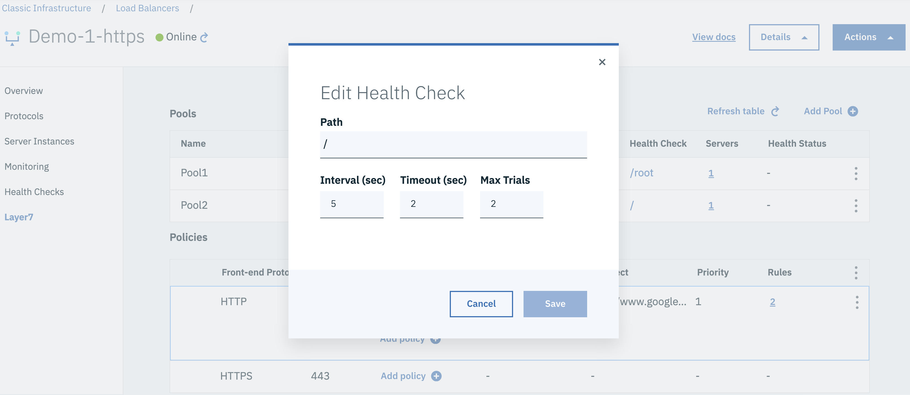

---

copyright:
  years: 2017, 2018, 2019
lastupdated: "2019-07-01"

keywords: l7, layer 7, pool, http

subcollection: loadbalancer-service

---

{:shortdesc: .shortdesc}
{:codeblock: .codeblock}
{:screen: .screen}
{:new_window: target="_blank_"}
{:pre: .pre}
{:note: .note}
{:important: .important}
{:tip: .tip}
{:table: .aria-labeledby="caption"}

# Layer 7 Pool
{: #layer-7-pool}

A Layer 7 (L7) pool is a logical grouping of the servers (members) for handling incoming requests.

The Layer 7 load balancing feature can direct the incoming traffic to different backend pools based
on the policies and rules. This feature is supported by associating multiple L7 pools with a load balancer. Layer 7 pools are used with the Layer 7 policies whose action is `redirect to pool`.

  

L7 pools support both HTTP and HTTPS as the backend protocol.

  

## Session Persistence
{: #session-persistence}

Session persistence can be configured for each Layer 7 pool. For more details, refer to the  
[advanced traffic section](/docs/infrastructure/loadbalancer-service?topic=loadbalancer-service-advanced-traffic-management-with-ibm-cloud-load-balancer).

## Layer 7 Members
{: #layer-7-members}

Backend servers that are associated with a Layer 7 Pool are called Layer 7 Members.

  

The same backend server can be added multiple times to L7 pools, by specifying a different port number each time.

  

## Configure Health Checks
{: #configure-health-checks}
The health check definition is mandatory for each Layer 7 pool. The system pre-populates a default health check configuration for L7 pools.

  

You may customize these settings to suit your application needs:

 * **Interval**: The interval in seconds between two consecutive health check attempts.
 * **Timeout**: The maximum amount of time the system will wait for a response to the health check request.
 * **MaxRetries**: The maximum number of additional health check attempts the system will make prior to declaring the service unhealthy.
 * **UrlPath**: The HTTP URL path for the Layer 7 health check.

  
